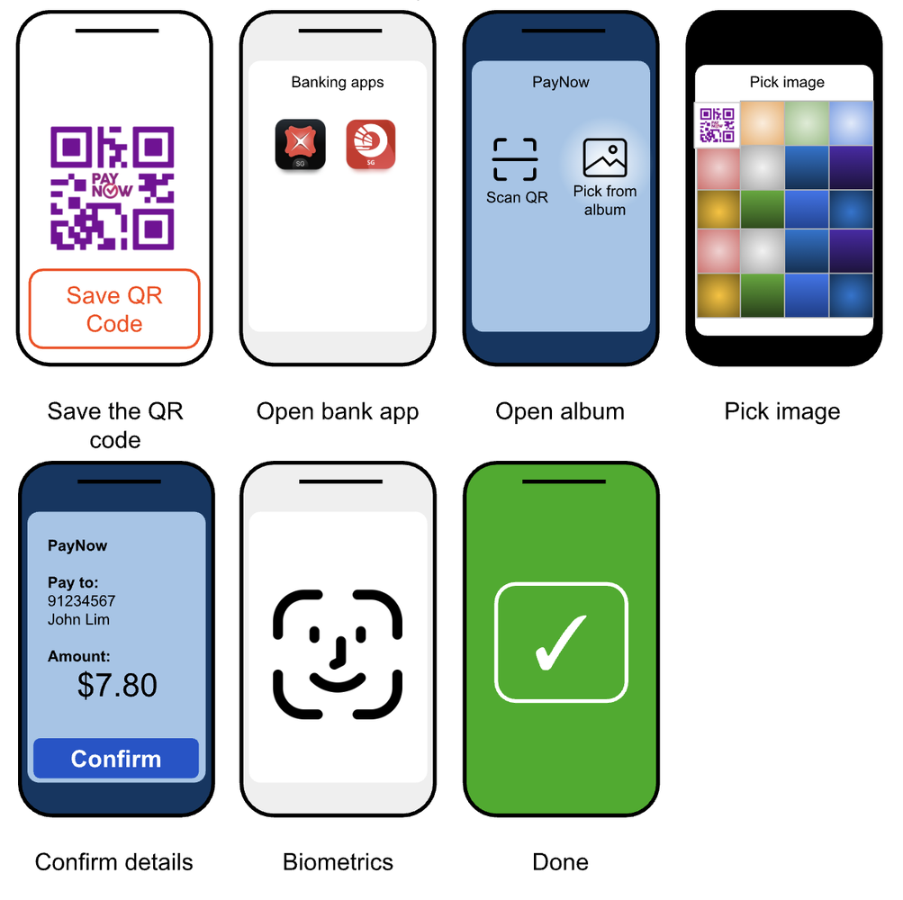

# Proposed specification for SGQR data URL

## Background

SGQR does not support deep linking today. That is, for any phone app or website that wants to offer PayNow, the user must follow
a unwieldy multistep process:

1. Download the payment QR code
2. Launch the banking app
3. Use the banking app to find the downloaded QR code
4. Complete payment using the banking app
5. Return to the website

To use a diagram I previously made:



## What makes deeplinking challenging?

Deep-linking for payment schemes have been around since at least 2017 with
UPI. UPI uses a deep-linking URL scheme that starts with `upi://pay?...`.

The problem is, unfortunately, iOS. For some bizarre reason, Apple does not
think that it's a good idea to allow multiple apps to support the same URL
scheme. This means that, when you activate a URL like `upi://`, an arbitrary
application that supports UPI will be selected. It does not matter whether you
prefer Google Pay, PayTM or PhonePe -- the operating system will select a random one
of these apps.

To quote [Apple documentation](https://developer.apple.com/documentation/xcode/defining-a-custom-url-scheme-for-your-app) as of July 2025, "_If multiple apps register the same scheme, the app the system targets is undefined. There’s no mechanism to change the app or to change the order apps appear in a Share sheet._".

Note: Android has no such limitation.

Apple's limitations on custom URL schemes is really odd, and one would suspect it's a ploy
to force applications to use Apply Pay for the most seamless experience possible (and thence
take their a 30% cut). This would, however, make it really difficult to use schemes like
SGQR, DuitNow, etc. that depend on an _ecosystem_ of interoperable apps.

Nevertheless, whether the conspiracy is real is a matter for regulators to decide.
I'm just here to propose an alternative.

I will not bother to define a spec for Android phones, because it's dead simple to define
a new URL scheme.

## The Specification (Apple phones)

### 1. File type

We will define a new file type:

| Trait           | Xcode Info.plist field             | Value                          |
|-----------------|------------------------------------|--------------------------------|
| Univeral type identifier (UTI) | UTTypeIdentifier    | sg.gov.mas.sgqr-data           |
| UTI parent      | UTTypeConformsTo                   | public.data                    |
| MIME Type       | UTTypeTagSpecification / public.mime-type | application/vnd.sg.gov.mas.sgqr-data |
| File extension  | UTTypeTagSpecification / public.filename-extension | sgqr           |

The contents of the file type is identical to the contents of an SGQR.

For example, a file that pays to the phone number 91234567 will look like the following:

```
00020101021126380009SG.PAYNOW010100211+6591234567030115204000053037025802SG5902NA6009Singapore6304B5DB
```

#### 1.1 UTImportedTypeDeclarations

Applications that support SGQR payments shall define a type declaration under `UTImportedTypeDeclarations`,
for SGQR data, and never under `UTExportedTypeDeclarations`. A declaration under
`UTExportedTypeDeclarations` shall be reserved for applications released by MAS.

The `UTImportedTypeDeclarations` shall define the UTI parent, MIME type and file extension as per part 1.

### 2. Applications that support SGQR payments

Applications that support SGQR payments _must_ define a Share Extension that accepts the UTI specified in part 1.

This may be achieved by defining `NSExtensionActivationRule` with the following data
```xml
<key>NSExtensionActivationRule</key>
<string>
    SUBQUERY (
        extensionItems,
        $extensionItem,
        SUBQUERY (
            $extensionItem.attachments,
            $attachment,
            ANY $attachment.registeredTypeIdentifiers UTI-CONFORMS-TO &quot;sg.gov.mas.sgqr-data&quot;
        ).@count >= 1
    ).@count >= 1
</string>
```

### 3. Triggering the payment interface

(This section does not prescribe any hard recommendations, but suggests a solution that worked in September 2025).

#### 3.1 Understanding the limitations

Apple does not seem to permit Share Extensions to transfer control to the main application. Therefore,
it is impossible to *open* your main payment application after SGQR data is shared.

There are [workarounds](https://stackoverflow.com/questions/27506413/share-extension-to-open-containing-app)
that existed but these gaps have been closed as of time of writing.

#### 3.2 Proposal to overcome the limitations

Share Extensions may emit a notification telling a user to "Continue payment in &lt;favourite banking app&gt;".
Tapping on the notification will transfer control to the main application.
Data contained in the notification can contain payment destination data, such as recipient, amount, and
descriptions.

This respository contains an example iPhone project, created with much help from ChatGPT and Gemini.

<script>

function shareSomething(mimeType, extension) {
    const phone = document.querySelector('#destination').value.slice(0, 8).padStart(8, '0')
    const amount = document.querySelector('#amount').value

    const dataText = `00020101021126380009SG.PAYNOW010100211+65${phone}03011520400005303702${amount.length.toString().padStart(2, '0')}${amount}5802SG5902NA6009Singapore6304CCCC`
    const buf = new TextEncoder().encode(dataText)

    const file = new File(
        [buf],
        `payment_to_${phone}.${extension}`,
        {
            type: mimeType
        }
    )

    navigator.share({
        files: [file]
    })
}

</script>

<label for="destination">Pay to phone number</label>
<input id="destination" type="tel" value="81234567">

<label for="amount">Payment amount</label>
<input id="amount" type="number" value="42.65">

<button onclick="shareSomething('application/vnd.sg.gov.mas.sgqr-data', 'sgqr')">
Pay!
</button>

